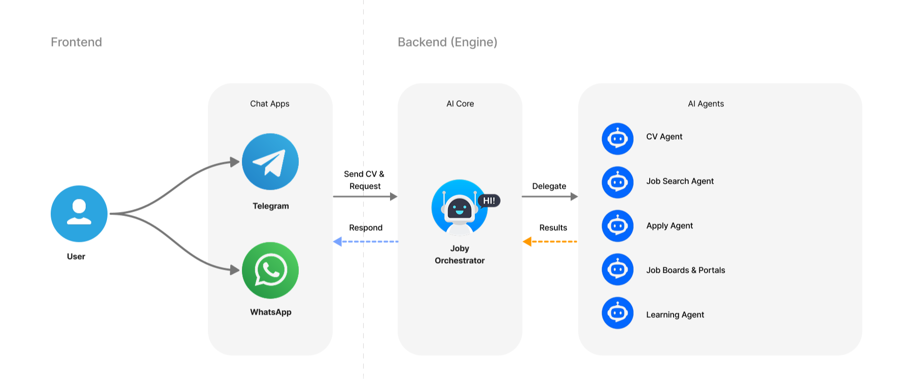
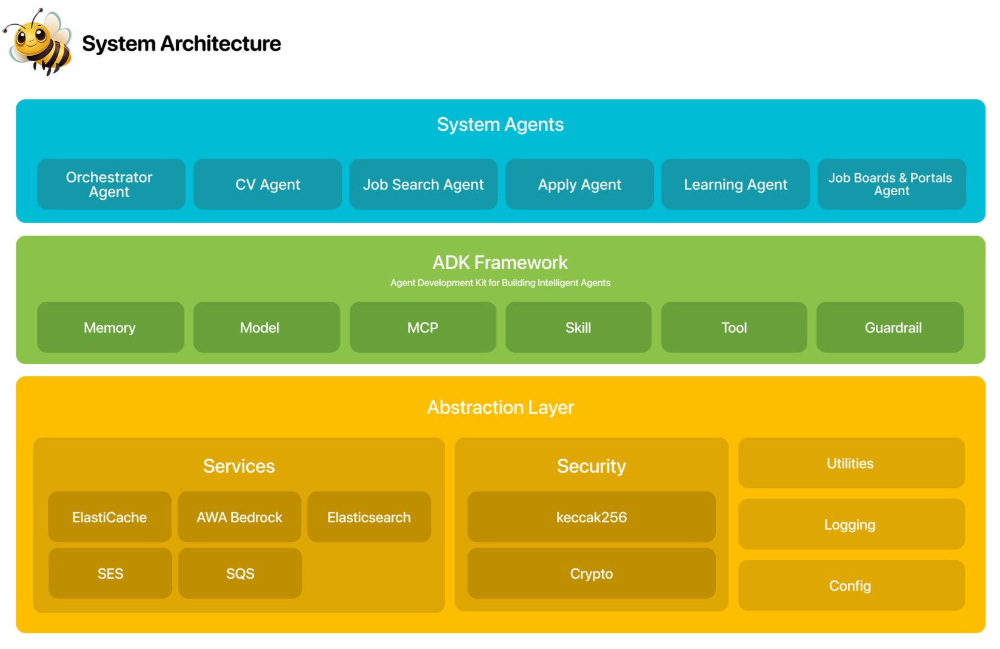

# 🐝Joby – Agentic AI Job Assistant

<div align="center">
    <picture>
        <source media="(prefers-color-scheme: light)" srcset="docs/img/joby-logo-text-dark.png">
        
    </picture>
    <h3 style="text-transform: uppercase; text-align: center; font-weight: bold">
        Your Autonomous AI Job-Hunting Agent
    </h3>
    <p>
        Your smart job assistant. Finds opportunities. Applies automatically. Secures your interviews—without you lifting a finger. 🐝🌻🍯✨
    </p>


</div>

---

**Joby** is an AI-powered smart recruitment assistant designed to fully automate the job search and application process.


### Problem

### Solution


### How it Works
The system analyzes the user’s CV, identifies suitable job opportunities across the internet, enhances the CV to match the requirements of each role using AI technologies, and finally submits applications on behalf of the user.

Joby relies on a Multi-Agent Architecture, where multiple AI agents work in harmony to perform tasks with high efficiency. This increases interview success rates while saving users significant time and effort throughout their job search journey.

The product currently operates through messaging platforms such as Instagram, with plans to expand to additional channels like WhatsApp and other communication platforms—making the service simple and seamless to access for users.



## Quick start
###  Prerequisites
- Node.js 20 or higher
### Setup Instructions
```shell
npnm intall
npm run dev
```

## Product
### Architecture
#### Product Architecture

#### Cloud Architecture
#### Agents Architecture
### Models
### Roadmap

## SECURITY

## License

This project is licensed under the [Apache License 2.0](./LICENSE) – see the [LICENSE](./LICENSE) file for details.

## Acknowledgments

Built with:
- [Elasticsearch](https://www.elastic.co/elasticsearch) - Elasticsearch is an open source, distributed search and analytics engine built for speed, scale, and AI applications.
- [AWS](https://)


## Community

This project is currently maintained. Contributions and suggestions are welcome. See [CONTRIBUTING.md](./CONTRIBUTING.md) for guidelines.
