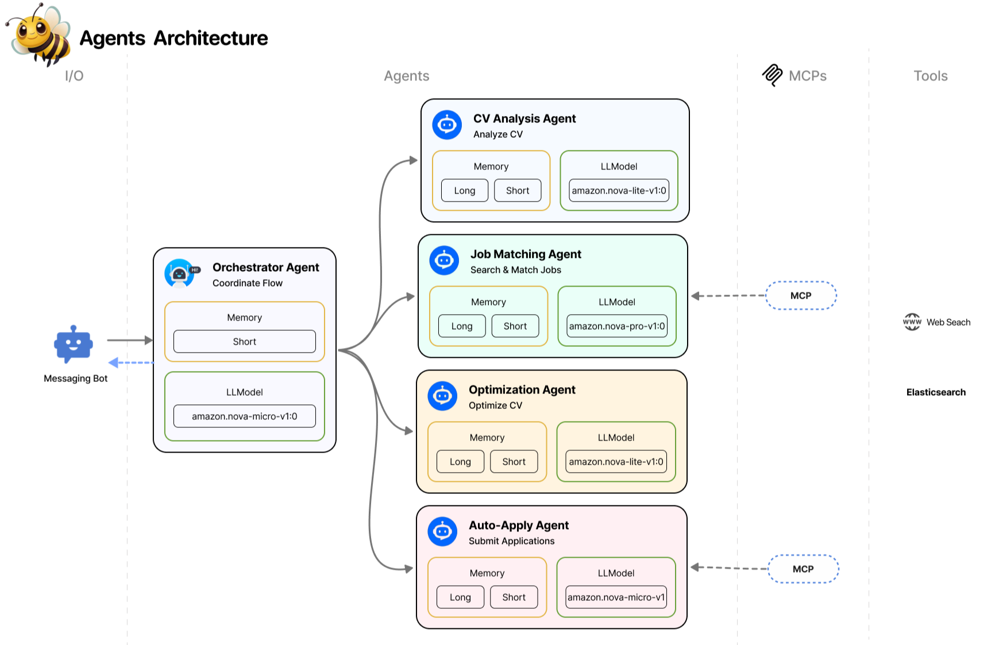
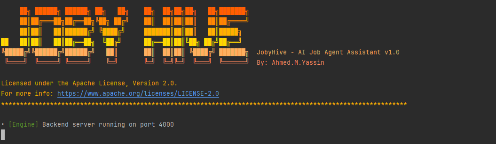

# 🐝 JobyHive – Agentic AI Job Assistant

<div align="center">
    <picture>
        <source media="(prefers-color-scheme: light)" srcset="docs/img/joby-logo-text-dark.png">
        
    </picture>
    <h3 style="text-transform: uppercase; text-align: center; font-weight: bold">
        Your Autonomous AI Job-Hunting Agent
    </h3>
    <p>
        Your smart job assistant. Finds opportunities. Applies automatically. Secures your interviews—without you lifting a finger. 🐝🌻🍯✨
    </p>


</div>

---

**Joby** is an AI-powered smart recruitment assistant designed to fully automate the job search and application process.


## Key Features

- **Automated Job Discovery**: Scans multiple platforms to find relevant roles based on your profile.
- **Smart CV Tailoring**: Automatically optimizes your CV for each specific job to beat ATS filters.
- **Autonomous Applications**: Submits applications on your behalf across various platforms.
- **Messaging-Native Interface**: Interact seamlessly via Telegram, WhatsApp, or Instagram.
- **Multi-Agent Orchestration**: Specialized AI agents collaborating to maximize interview conversion.

## How it Works

The system follows a sophisticated agentic workflow:
1. **Analysis**: The CV Analysis Agent extracts your core skills, experience, and intent.
2. **Matching**: The Job Matching Agent (powered by Elasticsearch) finds and indexes the best opportunities.
3. **Optimization**: The Optimization Agent adjusts your CV/Application to match job requirements perfectly.
4. **Execution**: The Auto-Apply Agent handles the submission and tracks progress.


## Technical Architecture

JobyHive is built as a modular monorepo for maximum scalability and reuse.

### Project Structure
- `apps/engine`: Core agent orchestration and automation logic.
- `apps/web`: High-performance landing page and dashboard (Next.js).
- `packages/*`: Shared services including `system-config`, `security`, `services` (AWS/Elasticsearch), and `ui`.

### Cloud Infrastructure (SST)
JobyHive leverages [SST (Ion)](https://sst.dev/) to define and manage a serverless AWS infrastructure, ensuring high scalability and cost-efficiency.

- **Storage (`sst.aws.Bucket`)**: Securely stores user CVs, matched job descriptions, and generated application documents.
- **Backend Engine (`sst.aws.Function`)**: The core AI orchestration engine, running as a Lambda function with direct access to storage and database resources.
- **Web Frontend (`sst.aws.Nextjs`)**: A modern Next.js interface providing a seamless landing experience.

### Stack
- **Infrastructure**: [SST v3 (Ion)](https://sst.dev/), AWS (Lambda, S3)
- **Framework**: [Turborepo](https://turbo.build/) + [pnpm](https://pnpm.io/)
- **Frontend**: Next.js 16, React 19, Tailwind CSS 4, Framer Motion
- **Backend/AI**: Node.js 20, Amazon Nova (Lite & Pro), AWS Bedrock
- **Data**: Elasticsearch, Redis

#### System & Agent Architecture
<div align="center">
    
    
</div>

## Getting Started

### Prerequisites
- [Node.js](https://nodejs.org/) 20 or higher
- [pnpm](https://pnpm.io/) (highly recommended)

### Setup Instructions

#### Local Development
```shell
# Install dependencies
pnpm install

# Start development servers
pnpm dev
```

#### Running with Docker (Recommended)
The easiest way to run the entire JobyHive ecosystem, including the Engine, Web Frontend, and infrastructure (Redis, LocalStack, MinIO, DynamoDB), is using Docker:

```shell
# Build and start all services
docker compose up --build
```

Once running:
- **Web Frontend**: `http://localhost:3000`
- **Engine API**: `http://localhost:4000`
- **Infrastructure**: Local services like Redis (6379) and LocalStack (4566) are automatically configured.

#### Cloud Deployment (SST)
To deploy the infrastructure to your AWS account:

```shell
# Deploy to production stage
pnpm run deploy:prod
```

<div align="center">
    
</div>

## Roadmap & Vision

We are moving from "job searching" to "job securing."
- [x] Multi-agent orchestration engine
- [x] Telegram bot integration
- [x] Automated CV tailoring
- [ ] WhatsApp & Instagram expansion
- [ ] Interview probability scoring
- [ ] Feedback loops from recruiter responses

Detailed strategy: [`VISION.md`](./VISION.md)

## Security

User privacy and data security are our top priorities. We implement minimal data retention and encrypted storage.
See our [Security Policy](./SECURITY.md) for details.

## License

This project is licensed under the [Apache License 2.0](./LICENSE).

## Acknowledgments

- **Elasticsearch**: Powering our high-speed, AI-driven search engine.
- **AWS (Amazon Nova)**: Providing state-of-the-art LLMs for agent logic.

A heartfelt thanks to the open-source community and the maintainers of the libraries that make JobyHive possible. For a complete list of third-party attributions, please refer to the [NOTICE](./NOTICE) file.

## Community

This project is currently maintained. Contributions and suggestions are welcome. See [CONTRIBUTING.md](./CONTRIBUTING.md) for guidelines.

---

<p align="center">Built with 🍯 by <a href="https://github.com/airqb" target="_blank">Ahmed.M.Yassin</a></p>
